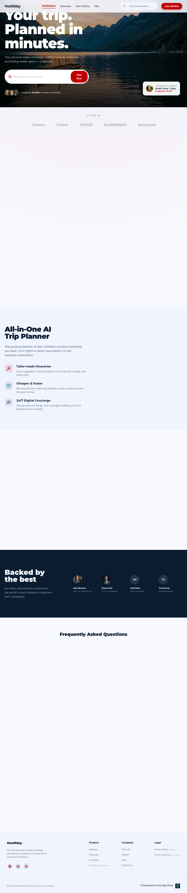
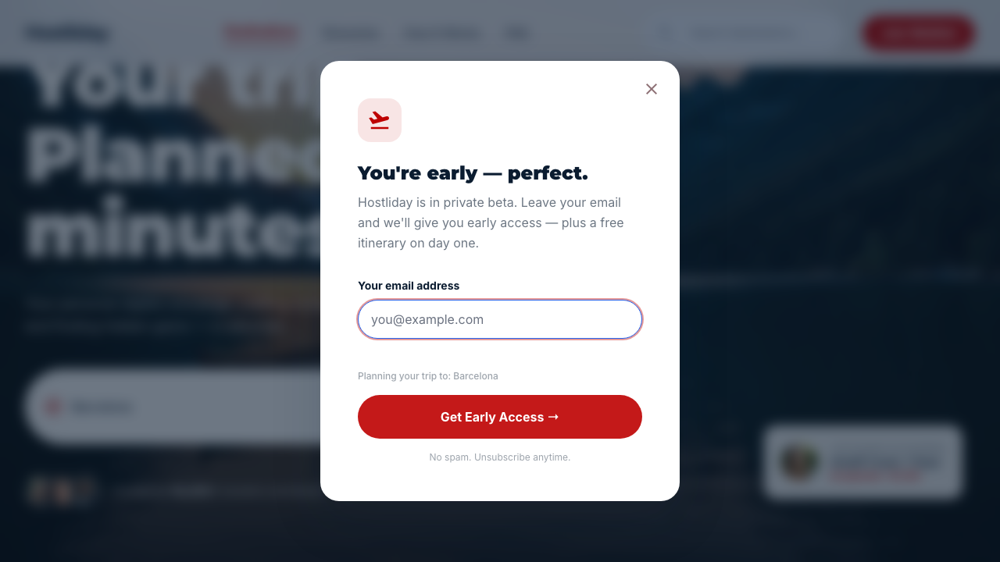

# QA Report: Hostliday Landing

| Field             | Value                                                                            |
| ----------------- | -------------------------------------------------------------------------------- |
| **Date**          | 2026-04-17                                                                       |
| **URL**           | `http://127.0.0.1:4173/`                                                         |
| **Branch**        | `main`                                                                           |
| **Commit**        | `5297cb6` (2026-04-17)                                                           |
| **PR**            | —                                                                                |
| **Tier**          | Standard                                                                         |
| **Scope**         | Landing page: hero search, waitlist modal, anchor navigation, FAQ, mobile layout |
| **Duration**      | ~38 minutes                                                                      |
| **Pages visited** | 5                                                                                |
| **Screenshots**   | 9                                                                                |
| **Framework**     | Vite static site                                                                 |
| **Index**         | —                                                                                |

## Health Score: 100/100

| Category      | Score |
| ------------- | ----- |
| Console       | 100   |
| Links         | 100   |
| Visual        | 100   |
| Functional    | 100   |
| UX            | 100   |
| Performance   | 100   |
| Accessibility | 100   |

## Top 3 Things to Fix

1. **ISSUE-001: Hero search lost destination on click** — fixed
2. No additional medium-or-higher issues found in the tested flows.
3. No console or mobile overflow regressions found.

## Console Health

| Error | Count | First seen |
| ----- | ----- | ---------- |
| —     | 0     | —          |

## Summary

| Severity  | Count |
| --------- | ----- |
| Critical  | 0     |
| High      | 0     |
| Medium    | 1     |
| Low       | 0     |
| **Total** | **1** |

## Issues

### ISSUE-001: Hero search lost destination on CTA click

| Field        | Value                    |
| ------------ | ------------------------ |
| **Severity** | medium                   |
| **Category** | ux                       |
| **URL**      | `http://127.0.0.1:4173/` |

**Description:** Typing a destination into the hero search and pressing `Enter` preserved the destination in the waitlist modal, but clicking `Plan Now` dropped it. Same input, different result. That is a real UX inconsistency on the page's main conversion path.

**Repro Steps:**

1. Navigate to the homepage and type `Barcelona` into the hero search.
   
2. Click `Plan Now`.
3. **Observe:** the waitlist modal opens without the destination context text under the email field.
   

---

## Fixes Applied

| Issue     | Fix Status | Commit    | Files Changed |
| --------- | ---------- | --------- | ------------- |
| ISSUE-001 | verified   | `5297cb6` | `index.html`  |

### Before/After Evidence

#### ISSUE-001: Hero search lost destination on CTA click

**Before:** 
**After:** 

---

## Regression Tests

| Issue     | Test File | Status  | Description                                                                                                                  |
| --------- | --------- | ------- | ---------------------------------------------------------------------------------------------------------------------------- |
| ISSUE-001 | —         | skipped | No project-local test framework is configured. Browser regression was verified with an isolated Playwright runner in `/tmp`. |

### Deferred Tests

None.

---

## Ship Readiness

| Metric        | Value                                        |
| ------------- | -------------------------------------------- |
| Health score  | 99 → 100 (+1)                                |
| Issues found  | 1                                            |
| Fixes applied | 1 (verified: 1, best-effort: 0, reverted: 0) |
| Deferred      | 0                                            |

**PR Summary:** "QA found 1 issue, fixed 1, health score 99 → 100."
